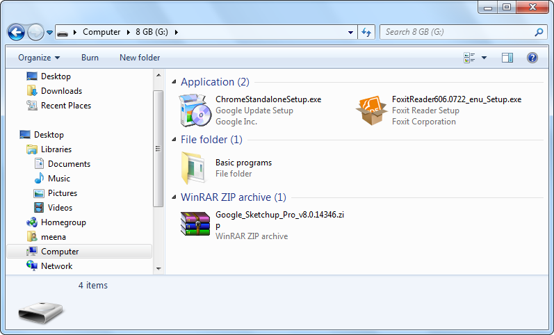
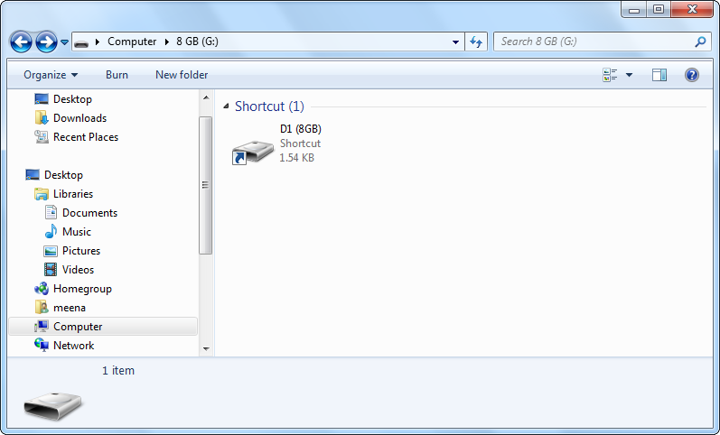
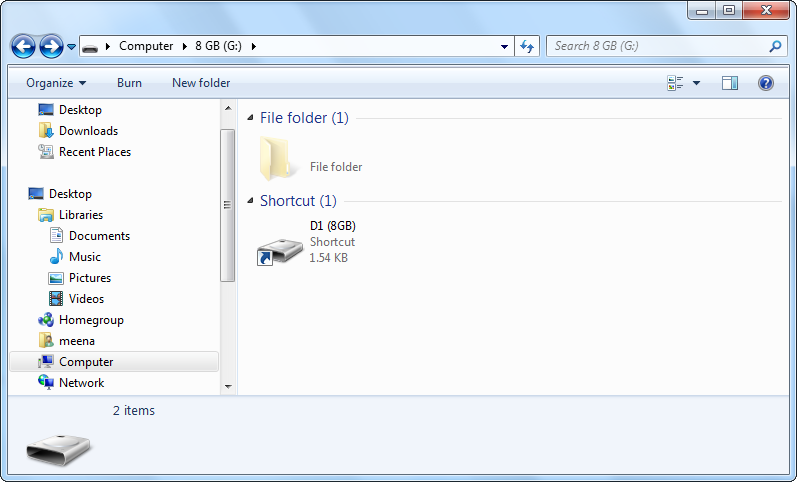
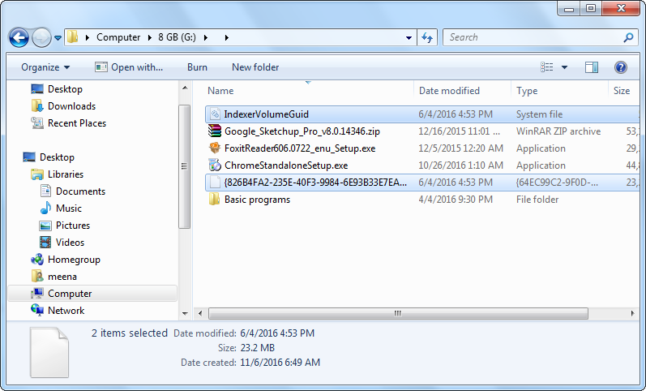

## Overview
A common problem that annoys many windows users is that developing a malware to spreads like an epidemic from PC to pen drive and vice versa is too easy. One thing I like the most about windows is that as a developer, it supplies me by extra more power.
I hope my extremely simple application protect some inexpert users from most nowadays computer worms.
## History
#### Back to Windows 2003 (XP)
Microsoft made a double-edged sword named auto-play that means that you could specify any file in the drive to be launched once the drive is mounted... So, lets say you have a file named **setup.exe**, all you have to do is:
 1. Create a new file in the pen drive (not inside any folders) and name it **autorun.inf** (character case insensitive)
 2. Open it with notepad and add the following lines of plain text...
```
[AutoRun]
open=setup.exe
```

I think the above code does not require any additional explanation. But, that's not everything!
```
[AutoRun]
open = setup.exe 
shell\open\command = setup.exe 
shell\explore\command = setup.exe 
shell\autoplay\command = setup.exe 
icon = icon.ico
```
The above **autorun.inf** specifies what each of the [open], [explore], and  [autoplay] commands does. So, lets say **setup.exe** is a virus, no matter what you do, the virus will be launched. And finally, just like TNT, it was mainly used for evil and it was removed from all later versions (not completely. the icon line is supported).

Later on, virus developers had some trouble making their application run by itself after disabling autorun. And the main challenge was switched to ***"How to make the user run the virus?"*** but unfortunately, that wasn't really a "*challenge*"

#### Folder-like Shortcut trick
Currently the most common trick to make the user run the virus is:
 1. The virus hides the original content of the pen drive
 2. The virus displays nothing in the pen drive but a shortcut to the virus
 3. When the user runs the virus, it tries to demonstrate that everything is fine by opening the folder containing the original content of the pen drive.
 
##### Example
The below screenshot shows the content of a pen drive before being infected.


And that's how it looks like after being infected.


And that's how it looks like after showing hidden files and folders from the Folder Options



The original content of the drive was moved to a hidden folder that has no name (actually its name is a null character) and the displayed shortcut is a shortcut to run the virus.

The virus itself is hiding in the same directory with the original content.



## What this code does
This script waits in the background until a new drive is mounted. Once that happen, it shows any hidden files or folders and deletes any shortcuts existing on the drive's directory (not inside any folder).


## Instructions
From any browser on windows desktop, open [WDCBackgroundService.vbs](https://raw.githubusercontent.com/meena-erian/Windows-Drive-Cleaner/master/WDCBackgroundService.vbs)(of size less than 1KB) and press **Ctrl+S**, name the file **WDCBackgroundService.vbs** (not ~~**WDCBackgroundService.vbs.txt**~~) and save it on your startup folder.(So that it runs on the background each time you start your computer) and double click on the file to initialize it (nothing would happen apparently)

Note: the startup folder is located in **"C:\Users\\[user]\AppData\Roaming\Microsoft\Windows\Start Menu\Programs\Startup"** starting from windows 7 and in **"C:\Documents and Settings\\[user]\Start Menu\Programs\Startup"**  for earlier versions of windows.

## Test
After installing the application, to try it and check how it works, download [Pseudo Infected Drive.rar](https://github.com/meena-erian/Windows-Drive-Cleaner/raw/master/test/Pseudo%20Infected%20Drive.rar).

After extracting [Pseudo Infected Drive](test/Pseudo Infected Drive), it's content will simulate the content of an infected drive but it's 100% safe. Explore it and try to click on the **Trap1.lnk** shortcut that represents the shortcut to the virus. Then view hidden files and folders from the **Folder Option** to see the actual content.
When you are done checking the pseudo infected drive, save it to a removable drive, unplug it from the computer, and then reconnect it again to see how DEW edits its content.

Note that when you try to run the pseudo virus, windows may pop-up an alarm warning you that it was downloaded from the internet. That would not happen in case it was an actual virus saved in a removable drive.

Please make sure to report any [issues](https://github.com/meena-erian/Windows-Drive-Cleaner/issues) or suggestions.

-------------------------------------------------------------------------------------------------- *Thanks for reading*
